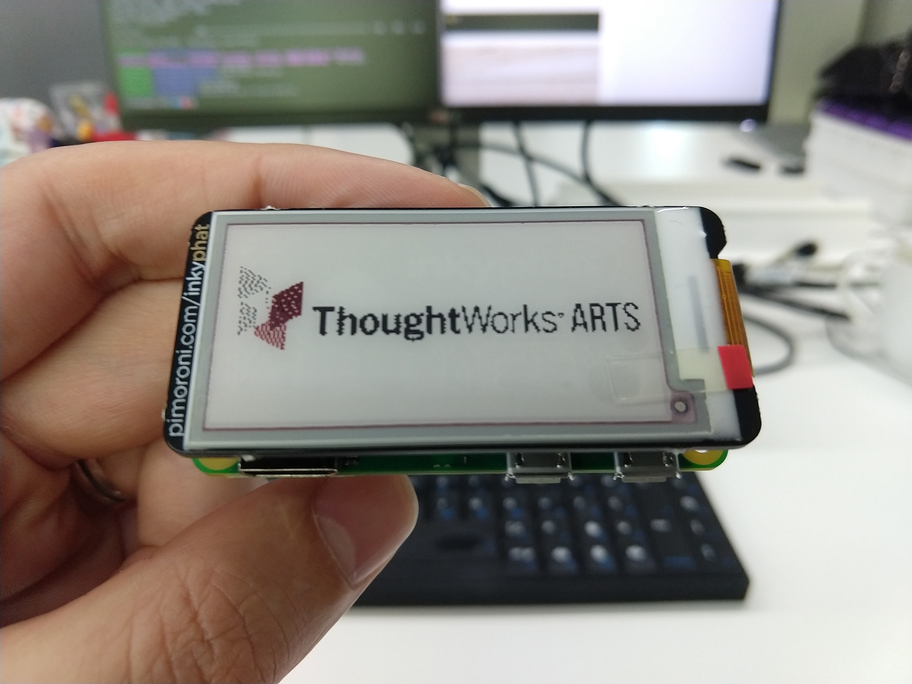

# Inky Badge

A ThoughtWorks Arts badge displayed on a [Pimoroni Inky PHAT](https://shop.pimoroni.com/products/inky-phat)

+ Setup InkyPHAT, follow the [installation instructions](https://learn.pimoroni.com/tutorial/sandyj/getting-started-with-inky-phat)
+ Clone this repo
+ Run `python logo.py`

# TODO
+ Display some name or contact info about who is wearing the badge.
